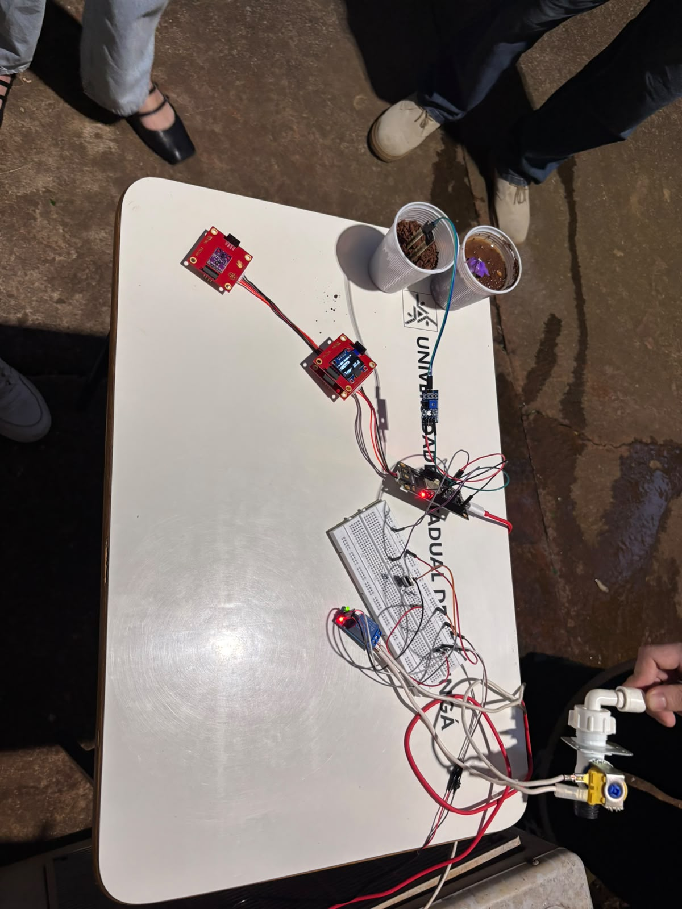

> Smart irrigation that takes care of your garden while you don't.

---

## Acknowledgements

Thanks to the MYOSA community and mentors for the support during development. (Optional)

---

## Overview

Explain clearly what the project does, what problem it solves, and why it exists.

**Key features:**
* Automatic soil moisture monitoring
* Automated watering triggered by sensor readings
* Real-time data display
* Low power / low cost setup

---

## Demo / Examples

### Images

All images must be placed in the same folder as this markdown file.

<p align="center">
  <br/>
  <i>Assembled automated garden system</i>
</p>

### Videos

YouTube links are NOT allowed. Upload your video as a local `.mp4` file, in the same folder.

<video controls width="100%">
  <source src="demo-automated-garden.mp4" type="video/mp4">
</video>

---

## Features (Detailed)

Explain in detail how the project works, broken into subsections.

### 1. Moisture Sensing
Explain the feature.

### 2. Automatic Watering
Explain the feature.

### 3. Data Display
Explain the feature.

---

## Usage Instructions

Explain how others can use this project.

Commands:
```plaintext
python main.py --mode auto
```

Scripts:
```python
# Example Python snippet
def read_moisture():
    print("Reading soil moisture...")
```

---

## Tech Stack

* **Arduino / ESP32**
* **Soil Moisture Sensor**
* **Water Pump + Relay Module**
* **Python**

---

## Requirements / Installation

List all dependencies clearly:

```bash
pip install pyserial numpy
```

---

## File Structure (Optional)

```
/automated-garden
  ├─ myosa-horta-automatica.md
  ├─ cover.jpeg
  ├─ demo-automated-garden.mp4
  └─ main.py
```

---

## License (Optional)

State your license here if applicable.

---

## Contribution Notes (Optional)

Explain how people can contribute, open issues, or submit improvements.
